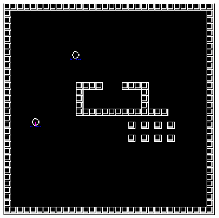
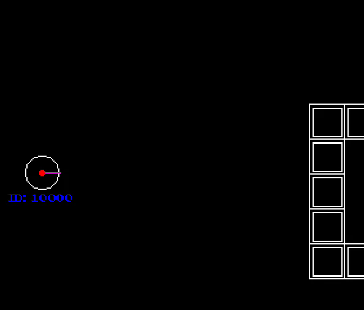

## MMO Game
Simple Massively Multiplayer Online (MMO) Game in C++ for learning purposes.

___
### Development made based on the code and lessons of Javidx9's:

 - GitHub: https://github.com/OneLoneCoder/Javidx9
 - YouTube Channel: http://youtube.com/javidx9
 - Networking in C++ video series
    - [Part #1: MMO Client/Server, ASIO & Framework Basics](https://www.youtube.com/watch?v=2hNdkYInj4g)
    - [Part #2: MMO Client/Server, ASIO, Sockets & Connections](https://www.youtube.com/watch?v=UbjxGvrDrbw)
    - [Part #3: MMO Client/Server Framework, Tweaks & Client Validation](https://www.youtube.com/watch?v=hHowZ3bWsio)
    - [Part #4: MMO - Designing Passivity](https://www.youtube.com/watch?v=f_1lt9pfaEo)

___
### New features added:
  - 2D Orientation
  - Players can shoot
  - ThreadSafeQueue template class refactored

