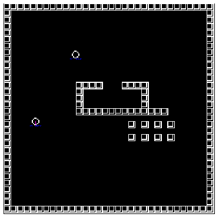

## Networking Projects
### Contents
 - [x] async_asio_tcp_echo_server
 - [ ] async_asio_tcp_echo_server_cpp20
 - [x] MMO Game

### [async_asio_tcp_echo_server](https://github.com/rafaelbarretorb/networking_projects/tree/main/async_asio_tcp_echo_server) 
Implementation of asynchronous TCP Server capable to handle multiple connections and process requests from multiple clients.
- C++ 17
- Boost.Asio
- Lambda functions (since C++11)
- Asynchronous TCP Server and Client

### async_asio_tcp_echo_server_cpp20 
Same project above but now using coroutines(since C++20).
- C++ 20
- Boost.Asio
- Coroutines (since C++20)
- Asynchronous TCP Server and Client

### [MMO_Game](https://github.com/rafaelbarretorb/networking_projects/tree/main/MMO_Game) 
Simple Massively Multiplayer Online (MMO) Game in C++. Development made based on the code and lessons of Javidx9 (see more in README). Using C++17 and Asio.
- C++ 17
- Boost.Asio
- Original code reorganized and changed it style rules.
- New features added
    - new

### References

 - [Boost.Asio Library official page](https://www.boost.org/doc/libs/1_78_0/doc/html/boost_asio.html)
 - Book "Boost.Asio C++ Network Programming Cookbook" by Dmytro Radchuk
 - [Networking in C++ Part #1: MMO Client/Server, ASIO & Framework Basics](http://youtube.com/javidx9)